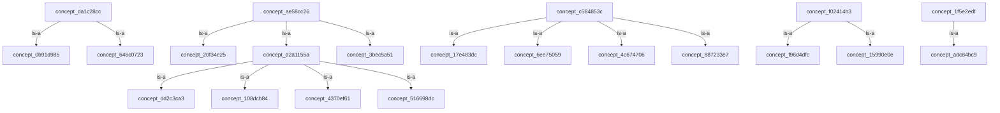

# Stage 3: Taxonomy

```mermaid
graph TD
    concept_da1c28cc -->|is-a| concept_0b91d985
    concept_da1c28cc -->|is-a| concept_646c0723
    concept_ae58cc26 -->|is-a| concept_20f34e25
    concept_ae58cc26 -->|is-a| concept_d2a1155a
    concept_ae58cc26 -->|is-a| concept_3bec5a51
    concept_c584853c -->|is-a| concept_17e483dc
    concept_c584853c -->|is-a| concept_6ee75059
    concept_c584853c -->|is-a| concept_4c674706
    concept_c584853c -->|is-a| concept_887233e7
    concept_f02414b3 -->|is-a| concept_f96d4dfc
    concept_f02414b3 -->|is-a| concept_15990e0e
    concept_d2a1155a -->|is-a| concept_dd2c3ca3
    concept_d2a1155a -->|is-a| concept_108dcb84
    concept_d2a1155a -->|is-a| concept_4370ef61
    concept_d2a1155a -->|is-a| concept_516698dc
    concept_1f5e2edf -->|is-a| concept_adc84bc9
```