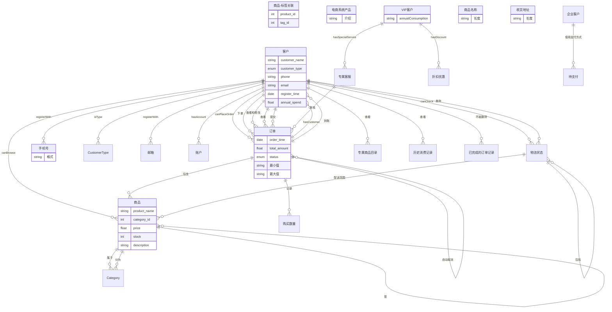

# Stage 4: Relations & Properties

```mermaid
erDiagram
    客户 {
        string customer_name
    }
    客户 {
        enum customer_type
    }
    客户 {
        string phone
    }
    客户 {
        string email
    }
    客户 {
        date register_time
    }
    客户 {
        float annual_spend
    }
    商品 {
        string product_name
    }
    商品 {
        int category_id
    }
    商品 {
        float price
    }
    商品 {
        int stock
    }
    商品 {
        string description
    }
    订单 {
        date order_time
    }
    订单 {
        float total_amount
    }
    订单 {
        enum status
    }
    商品-标签关联 {
        int product_id
    }
    商品-标签关联 {
        int tag_id
    }
    电商系统产品 {
        string 介绍
    }
    VIP客户 {
        string annualConsumption
    }
    手机号 {
        string 格式
    }
    订单 {
        string 最小值
    }
    订单 {
        string 最大值
    }
    商品名称 {
        string 长度
    }
    收货地址 {
        string 长度
    }
    订单 ||--o{ 客户 : "hasCustomer"
    客户 ||--o{ CustomerType : "isType"
    VIP客户 ||--o{ 专属客服 : "hasSpecialService"
    VIP客户 ||--o{ 折扣优惠 : "hasDiscount"
    客户 ||--o{ 手机号 : "registerWith"
    客户 ||--o{ 邮箱 : "registerWith"
    客户 ||--o{ 账户 : "hasAccount"
    客户 ||--o{ 商品 : "canBrowse"
    客户 ||--o{ 订单 : "canPlaceOrder"
    客户 ||--o{ 物流状态 : "canCheck"
    商品 ||--o{ Category : "属于"
    商品 ||--o{ 商品 : "是"
    商品 ||--o{ Category : "分为"
    客户 ||--o{ 订单 : "下单"
    订单 ||--o{ 商品 : "包含"
    订单 ||--o{ 购买数量 : "记录"
    订单 ||--o{ 订单 : "状态"
    订单 ||--o{ 订单 : "自动取消"
    物流状态 ||--o{ 商品 : "配送范围"
    物流状态 ||--o{ 物流状态 : "包括"
    客户 ||--o{ 物流状态 : "查询"
    企业客户 ||--o{ 待支付 : "使用支付方式"
    客户 ||--o{ 订单 : "查看和修改"
    客户 ||--o{ 订单 : "查看"
    客户 ||--o{ 专属商品目录 : "查看"
    客户 ||--o{ 历史消费记录 : "查看"
    客户 ||--o{ 已完成的订单记录 : "不能删除"
    客户 ||--o{ 订单 : "提交"
    专属客服 ||--o{ 订单 : "审核"
    订单 ||--o{ 客户 : "到账"
```